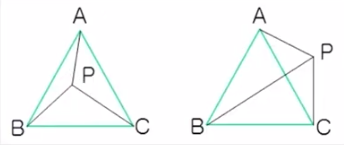

##### Web-Study-Note

## JS实现JD无延迟菜单笔记

开发基础：HTML CSS  Jquery

教程网址：https://www.imooc.com/learn/829 

讲师：呵呵SN

- ### Part1 实现分类导航菜单的基本布局结构

  1.菜单整体的CSS样式采用相对定位使子菜单相对于外围容器定位而不是相对于body

  2.使用无序列表  `<ul></ul>`  实现一级菜单结构

  3.采用height == line-hight == 30px 实现文字的垂直居中(一种方法)

  4.用span添加内部文字实现hover效果

  note: 当样式的切换需要用到js来控制时，就添加类，因为js可以很方便的删除和移动类

  ​	  如果不需要js来控制，直接用类似   `:hover` 的伪类来添加样式

  5.二级菜单用dl dt dd实现符合语义化  箭头 `&gt;`

  6.二级菜单使用绝对定位

  7.a标签的常用大小是12px

  8.使用overflow:hidden触发二级菜单的BFC: block formating context

  令他可以被浮动元素撑开而不是失去自己的高度

  ```
  overflow:hidden;
  font: 400 9px/14px consolas;
  // 分号前面是font-size 后面是line-height
  ```

- ### Part2 开发普通的二级菜单效果


​	1.以事件代理的方式进行绑定

​	2.mouseenter和mouseover的区别

​               a.  使用mouseover和mouseout时如果鼠标移动到子元素上，即便没有离开父元素，

​	       也会触发父元素的mouseout事件	

​	       b. 使用mouseenter和mouseleave时，如果鼠标没有离开父元素在其子元素上任意移动，

​	       也不会触发mouseleave事件   			


- ### Part3 加入延迟解决移动问题

  ##### 加入延迟进行优化

	切换子菜单时用setTimeout设置延迟

	debounce去抖技术：在事件被频繁触发时只执行一次处理


- ### Part4 解决延迟引入的新问题

  ##### 基于用户行为预测的切换技术：

  跟踪鼠标的移动

  用鼠标当前位置，和鼠标上一次位置与子菜单上下边缘形成的三角形区域进行比较

    ##### 		优化原理

​	判断点是否在鼠标当前点和二级菜单的上边缘及下边缘组成的三角形内

​	PA PB PC 的叉乘结果符号相同时在三角形内

​	

```
// 判断两个数的符号是否相同 (用异或运算判断)
function sameSign (a, b) {
  return (a ^ b) >= 0
}

// 向量的计算，终点坐标减去起点坐标
function vector (a, b) {
  return {
    x: b.x - a.x,
    y: b.y - a.y
  }
}

// 向量的叉乘公式
function vectorProduct (v1, v2) {
  return v1.x * v2.y - v2.x * v1.y
}

// 判断鼠标当前点是否在三角形内
function isPointInTrangle (p, a, b, c) { // p是鼠标当前点
  var pa = vector(p, a)
  var pb = vector(p, b)
  var pc = vector(p, c)

  var t1 = vectorProduct(pa, pb)
  var t2 = vectorProduct(pb, pc)
  var t3 = vectorProduct(pc, pa)
  // t1 t2 t3 符号相同时点在三角形内
  return sameSign(t1, t2) && sameSign(t2, t3)
}
// 判断是否需要延迟的函数
function needDelay (elem, leftCorner, currMousePos) {
  // 利用Jquery的offset方法获取二级菜单的上下边缘的坐标
  var offset = elem.offset()

  var topLeft = {
    x: offset.left,
    y: offset.top
  }

  var bottomLeft = {
    x: offset.left,
    y: offset.top + elem.height()
  }

  return isPointInTrangle(currMousePos, leftCorner, topLeft, bottomLeft)
}

```

