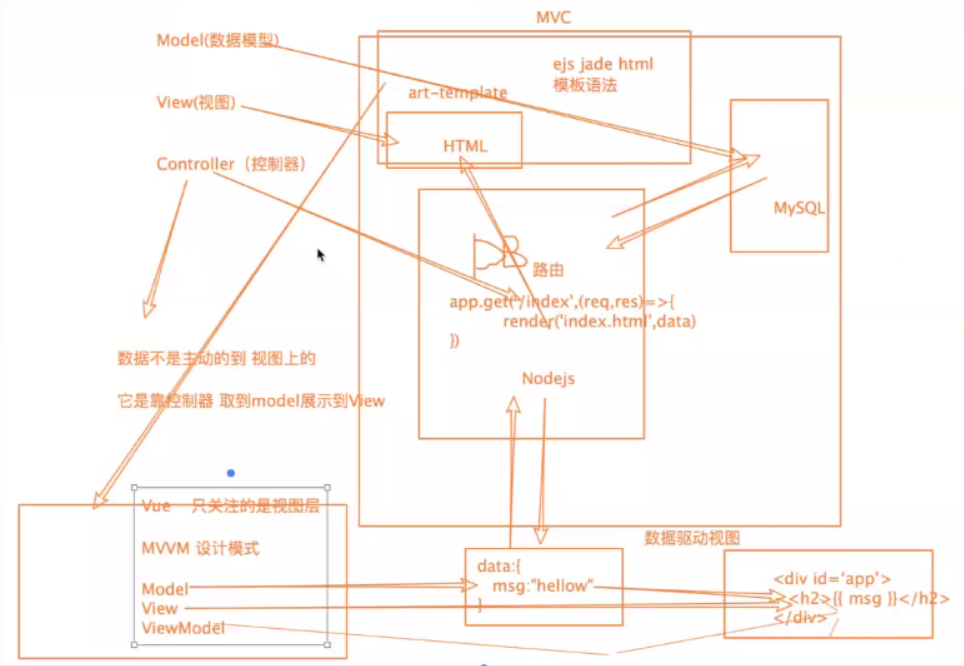

# Vue Notes

### Vue基础

#### (1)Vue介绍

**渐进式**JavaScript框架



#### (2)前端框架和库的区别

Jquery 封装一些DOM操作和ajax类请求

art-template 模板引擎 渲染DOM

Vue框架 全方位功能齐全：简易的DOM体验 + 发请求 + 模板引擎 + 路由功能

#### (3)vue起步

npm 安装

```
$ npm install vue
```

引入Vue.js

```
<script type="text/javascript" src="./node_modules/vue/dist/vue.js"></script>
```

创建实例化对象

```
<div id="#app">
	<h2>{{msg}}</h2>
</div>
<script>
        //创建实例化对象
        new Vue({
            el:'#app',
            data:{
                //既可以是一个对象,也可以是一个函数
                msg:'黄瓜'
            },
            //如果template中定义了内容 那么优先加载template,如果没有定义内容，加载的是#app的模板
            template:''
        });
</script>
```

#### (4)插值表达式

```
<div id="app">
        <!--vue的模板语法{{}}双大括号插值 react{} -->
        <h2>{{msg}}</h2>
        <h3>{{1+1}}</h3><!--也可以插入运算-->
        <h4>{{isTrue}}</h4><!--插入布尔值-->
        <h1>{{str.split('').reverse().join('')}}</h1><!--甚至可以插入一些JS的DOM 操作-->
        <h2>{{ 1>2 ? '真的':'假的'}}</h2><!--插入三元运算符-->
        <h3>{{'hahahahah'}}</h3><!--插入字符串-->
        <h3>{{ {name:'zhangsan'} }}</h3><!--插入对象-->

</div>
```

#### (5)Vue指令

- 在vue中提供了一些对于页面+数据的更为方便的输出，这些操作加做指令，以v-xxx表示  ex: `<div v-xxx></div>`

- 指令中封装了一些DOM行为，结合属性作为一个暗号，暗号有对应的值，根据不同的值，框架会进行相关DOM操作的绑定

- **v-xxx 指令演示**

  - v-text：元素的innerText属性，必须是双标签 跟{{}} 效果是一样的 使用较少

  - v-once：一次性插值`<span v-once>这个将不会改变: {{ msg }}</span>` 

  - v-html：元素的innerHtml

  - v-if：数据属性对应的值为假则不渲染，反之渲染 appendChild() removeChild()

  - v-else-if

  - v-else

  - v-show：控制dom元素的显示隐藏 display:none/block;

    - **v-if 和 v-show的区别（官网解释）**

      v-if 是真正的条件渲染，因为它会确保在切换过程中条件块内的事件监听器和子组件适当地被销毁和重建。

      v-if 也是惰性的：如果在初始渲染时条件为假，则什么也不做，直到条件第一次变为真时，才会渲染条件块

      相比之下，v-show 就简单的多，不管初始条件是什么，元素总是会被渲染，并且只是简单的基于CSS进行切换

      一般来说，v-if 有更高的切换开销，而v-show有更高的初始渲染开销

      因此，如果需要非常频繁地切换，则使用v-show较好；如果在运行时条件甚少改变，则使用v-if较好

  - v-bind：绑定标签上的属性（内置属性和自定义属性）简写为 `：`

  - v-on:原生事件名 = '函数名'  简写为 `@`

  - v-for = "(item,index) in menuLists" 遍历数组

    v-for = "(value,key) in object" 遍历对象

  - v-model

    用于双向数据绑定，只会体现在UI控件中，只能应用在有value属性的元素 

    实现原理：v-bind:value 结合 v-on:input 

#### (6)Vue组件

- ##### 局部组件

  声名局部组件，挂载到父组件上，在父组件中任意使用（声子，挂子，用子）

- ##### 全局组件

  Vue.component() 第一个参数是组件的名字，第二个参数是options

  ```
  Vue.component('Vbtn',{
  	template:'<button>按钮</button>'
  });
  ```

#### (7)Vue组件通信

- 父===>>子
  - 先给父组件中绑定自定义的属性
  - 在子组件中使用props接收父组件传递的数据
  - 可以在子组件中任意使用
- 子===>>父
  - 在父组件中绑定自定义的事件
  - 在子组件中触发原生的事件，在函数中使用this.$emit() 触发自定义的事件

#### (8)Vue插槽

- 内置组件slot作为承载分发内容的出口
- 具名插槽

#### (9)过滤器


